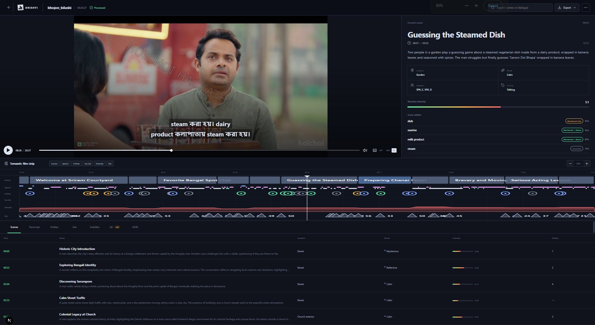

# Drishti (built for the hoichoi hackathon)

Drishti turns a Bengali episode into one semantic timeline for ad intelligence, subtitles, closed captions, and QC. This repository contains a Next.js 16 interface and a FastAPI backend based on the product and technical specifications in [`docs/`](docs/).




Backend deployed at: https://drishti-hoichoihackathon.onrender.com/docs

The app includes a populated demo episode, so all workspace interactions are available without model credentials or a source video.

## Run locally

Requirements: Node.js 20.9+ and Python 3.11+.

Start the API:

```powershell
cd backend
python -m pip install -e ".[dev,media]"
python -m uvicorn app.main:app --reload --port 8000
```

In a second terminal, start the web app:

```powershell
cd frontend
npm install
Copy-Item .env.local.example .env.local
npm run dev
```

Open `http://localhost:3000`. FastAPI docs are at `http://localhost:8000/docs`.

## Included

- Paste a YouTube or Google Drive link to download and process it through the same pipeline as uploads
- Episode pages open while processing and fill in as stages finish
- Ad decisions: hard constraints → safety → pacing → brand safety → brand fit, driven by `backend/config/brands.json`; "no break" when nothing qualifies
- VMAP manifest with inline VAST; the player plays the selected ad and resumes the episode; debug JSON under Export

- Episode library with drag-and-drop video upload and processing stages
- Synced player/demo playback, scene inspector, and zoomable semantic timeline
- Scenes, transcript, entities, ads, subtitles, QC, and JSON views
- Transparent ad-score components with configurable selection
- Bengali SRT/VTT and closed-caption downloads
- QC and timestamp navigation
- Timeline, cue-point, and QC exports
- FastAPI SSE progress stream and published Pydantic JSON Schema

Uploaded episodes run through a persistent, cached 18-stage pipeline. Install provider adapters and configure credentials for live Bengali diarization and multimodal understanding:

```powershell
cd backend
python -m pip install -e ".[providers]"
Copy-Item .env.example .env
# Set SARVAM_API_KEY and OPENAI_API_KEY in .env
```

Without `SARVAM_API_KEY`, a real upload stops at `s06_stt` with a retryable stage error; it never receives demo output. Stages before that point—including media probing, proxying, shot detection, keyframes, audio preparation, and VAD—remain cached. Add the key and call `POST /episodes/{id}/rerun` with `{"from_stage":"s06_stt","force":false}`.

The bundled demo is seeded as a separate processed episode. Local models from `docs/technical.md` (PySceneDetect, Silero VAD, PANNs audio events, SigLIP, Demucs) are used automatically when the `gpu` extra is installed (`pip install -e ".[gpu]"`); otherwise ffmpeg-based fallbacks run and the timeline records which method produced each artifact. Heavy stages can run on a separate GPU machine with `python -m pipeline.run --episode <id> --stages s02,s03,s04,s08`; see [`backend/README.md`](backend/README.md).

To run the UI with no backend at all, set `NEXT_PUBLIC_USE_MOCK=true` in `frontend/.env.local`.

## Deploy

The frontend runs on Vercel and the backend on Render (Docker), with Neon Postgres as the database. See [`docs/architecture.md`](docs/architecture.md) for how the pieces fit together.

**Backend (Render).** The repo includes a Render Blueprint, [`render.yaml`](render.yaml), which builds [`backend/Dockerfile`](backend/Dockerfile) (Python 3.11 + ffmpeg) as a single-instance web service on the free plan. The free plan has no persistent disk, so episode files are kept in Cloudflare R2 and restored after restarts.

Before deploying, create an R2 bucket in Cloudflare, plus an R2 API token with **Object Read & Write** on it. Note the account ID for the endpoint.

1. In Render, choose **New → Blueprint** and select this repository.
2. When prompted, fill in:
   - `DATABASE_URL` (Neon; use a separate branch from local dev)
   - `OPENAI_API_KEY`, `SARVAM_API_KEY` and, optionally, `HF_TOKEN`
   - `S3_ENDPOINT_URL` (`https://<account_id>.r2.cloudflarestorage.com`), `S3_BUCKET`, `S3_ACCESS_KEY_ID`, `S3_SECRET_ACCESS_KEY`
3. `CORS_ORIGINS` is preset to the production frontend URL and `http://localhost:3000`. Edit it in `render.yaml` if the frontend URL changes.

Keep the service at one instance: the job queue runs inside the API process. After deploying, `/health` should show `"object_storage": true`.

**Frontend (Vercel).** Create a Vercel project with **Root Directory** `frontend` and set:

- `NEXT_PUBLIC_API_URL`: the Render service URL, without a trailing slash. Point it at Render directly, not at the `/api` rewrite; requests routed through Vercel are capped at 4.5 MB, which rejects video uploads with a 413.
- `NEXT_PUBLIC_USE_MOCK=false`

`NEXT_PUBLIC_*` variables are embedded at build time, so redeploy after changing them. For a frontend-only demo with no backend, set `NEXT_PUBLIC_USE_MOCK=true`.

**Run the backend image locally:**

```powershell
cd backend
docker build -t drishti-api .
docker run -p 8000:8000 --env-file .env -v drishti-data:/data drishti-api
```

`backend/vercel.json` is kept for a read-only demo deployment of the API on Vercel. It can't process uploads: Vercel functions cap request bodies at 4.5 MB, their filesystem is temporary, and they stop running after each response.

## Verify

```powershell
cd backend
python -m pytest tests -q

cd ..\frontend
npm run build
```
