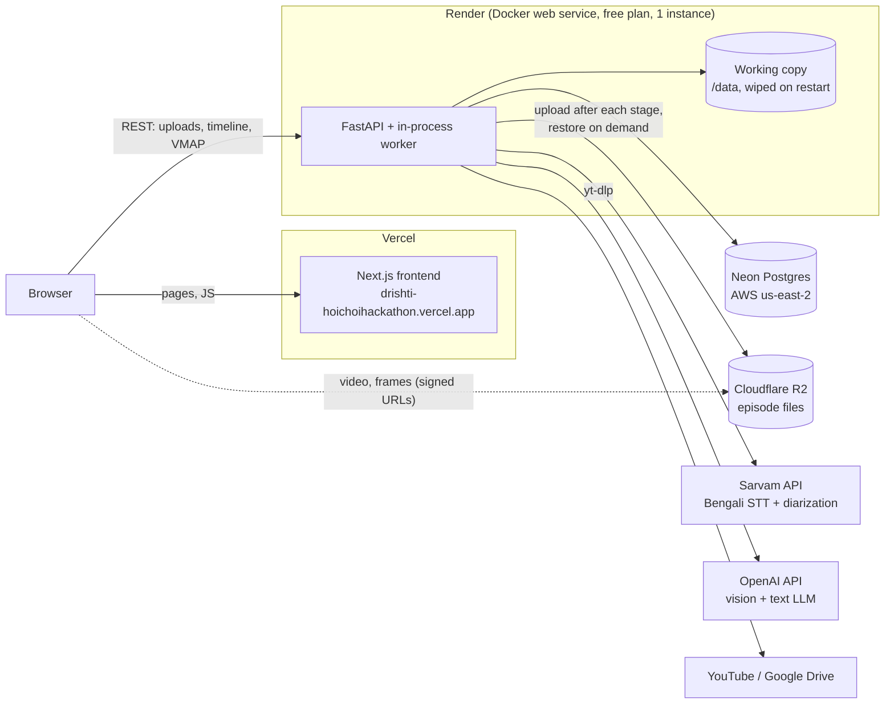
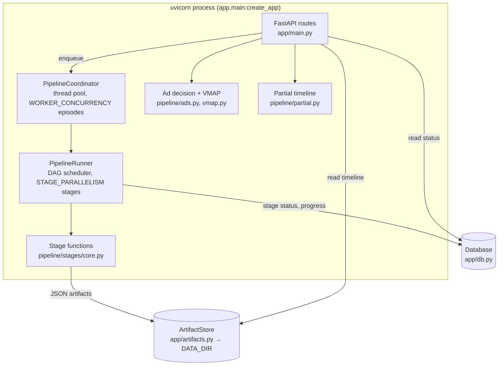
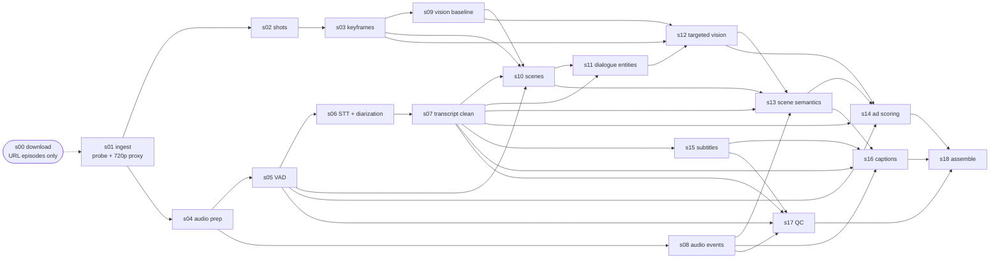

# Drishti — Architecture

How the system is built and deployed today. For the original design spec (schemas, per-stage algorithms, prompts), see [`technical.md`](technical.md). For product scope, see [`prd.md`](prd.md).

Drishti takes a Bengali episode (upload or YouTube/Drive link), runs it through an 18-stage pipeline, and produces one **semantic timeline**: scenes, transcript, entities, ad-break decisions, Bengali subtitles, closed captions and QC issues. The web app shows that timeline while it's still being built, and serves a VMAP ad manifest the player uses to insert the chosen ads.

---

## 1. Deployment



| Piece | Where | Config |
|---|---|---|
| Frontend | Vercel project rooted at `frontend/` | `frontend/vercel.json`, env `NEXT_PUBLIC_API_URL` |
| Backend | Render Docker web service rooted at `backend/` | [`render.yaml`](../render.yaml), [`backend/Dockerfile`](../backend/Dockerfile) |
| Database | Neon Postgres (SQLite at `/data/drishti.db` if `DATABASE_URL` is unset) | env `DATABASE_URL` |
| Episode files | Working copy in `/data` (temporary on the free plan), durable copy in Cloudflare R2 | env `DATA_DIR=/data`, `S3_*` |

**The browser talks to Render directly.** `NEXT_PUBLIC_API_URL` must be the Render URL, not the `/api` rewrite in `frontend/next.config.ts`. A request through Vercel is capped at 4.5 MB, which rejects any real video upload with a 413. `NEXT_PUBLIC_*` values are baked in at build time, so changing it needs a frontend redeploy.

**The backend must run as exactly one instance.** The job queue lives in process memory, so a second instance wouldn't see the first one's jobs.

**The free plan wipes `/data` on every restart,** including the sleep after about 15 minutes idle. Episode status survives in Neon and episode files survive in R2 (see [Storage](#4-storage)). A persistent disk also works: leave `S3_BUCKET` empty and mount a disk at `/data` on a paid plan.

The backend's old Vercel deployment (`backend/vercel.json`) still works for the read-only demo, but can't process uploads: 4.5 MB request limit, ephemeral `/tmp`, and no background work after a response.

---

## 2. Backend components



| Module | Role |
|---|---|
| `app/main.py` | App factory, routes, CORS, demo seeding, and startup resume of unfinished episodes |
| `app/settings.py` | All config via env / `backend/.env` (pydantic-settings), including tunable `Thresholds` and ffmpeg resolution |
| `app/db.py` | SQLModel tables `EpisodeRecord` and `StageRecord`: status, progress, per-stage timing and errors. Pings and recycles connections, since Neon drops idle ones |
| `app/artifacts.py` | Episode folder layout, atomic JSON/text writes, file and input hashing |
| `app/models.py` | Pydantic models, including `SemanticTimeline`, the API's main contract (served as JSON Schema at `/schema`) |
| `pipeline/runner.py` | Stage graph (`STAGES`), scheduler, cache checks, URL download step, `PipelineCoordinator` |
| `pipeline/stages/core.py` | The 18 stage implementations |
| `pipeline/llm.py` | OpenAI structured-output wrapper: response cache, retries, per-episode cost cap |
| `pipeline/sarvam.py` | Sarvam batch speech-to-text job (`saaras:v4`, `bn-IN`, codemix, diarization) |
| `pipeline/local_models.py` | Optional local models (PySceneDetect, Silero VAD, PANNs, SigLIP), used only when the `gpu` extra is installed |
| `pipeline/media.py` | ffmpeg / ffprobe wrappers. Falls back to parsing `ffmpeg -i` when ffprobe is absent |
| `pipeline/fetch.py` | yt-dlp download for YouTube / Google Drive links (≤720p MP4) |
| `pipeline/run.py` | CLI to run chosen stages on another machine, e.g. a GPU box |

---

## 3. Pipeline

### Stage graph

The audio branch and the video branch run in parallel until scene segmentation joins them.



`STAGES` in `pipeline/runner.py` is the source of truth for dependencies. For readability the diagram leaves out edges from `s01` to later stages and most edges into `s18`, which reads nearly every artifact.

### Execution

- **Scheduling:** the runner starts every stage whose dependencies are done, up to `STAGE_PARALLELISM` at a time (default 2). The coordinator runs up to `WORKER_CONCURRENCY` episodes at once (default 1).
- **Failure:** the first failed stage stops new stages from starting and marks the episode `failed`. The error is saved on that stage's row and shown in the UI.
- **Rerun:** `POST /episodes/{id}/rerun {"from_stage": "s06", "force": false}` restarts at that stage. Downstream stages rerun only if their inputs changed; `force` recomputes all of them.

### Caching

Every stage writes `stages/{stage_id}.json` plus a `.hash` sidecar. The hash covers the stage version, the hashes of its dependencies' artifacts, the current `Thresholds`, and, for `s01`, the source video itself. If the sidecar matches, the stage is skipped. Consequences:

- Rerunning an unchanged episode costs nothing.
- Changing a threshold, a dependency's output, or a stage's `version` invalidates exactly the stages affected.
- Validity lives next to the artifact, not in the database, so an episode folder produced on another machine (`python -m pipeline.run --episode <id> --stages s02,s03,s04,s08` on a GPU box) can be synced back and the API picks up where it left off.

LLM responses are cached separately under `cache/llm/`, keyed by model, prompt, schema and image hashes.

### Restart behaviour

On startup (FastAPI lifespan), every episode left in `queued`, `processing` or `downloading` is re-enqueued, provided it was created in this environment (its source path is under this `DATA_DIR`). With object storage configured, the run first restores the episode folder from R2, so stages that finished are cache hits and only the one that was mid-flight runs again. A redeploy or free-plan sleep therefore delays jobs but doesn't lose them.

### Providers and fallbacks

| Dependency | Used by | Without it |
|---|---|---|
| ffmpeg / ffprobe | s01–s05, s08, creatives | Required. Installed in the Docker image; `imageio-ffmpeg` is a pip fallback for ffmpeg |
| Sarvam (`SARVAM_API_KEY`) | s06 | **Pipeline stops at s06** with a retryable error. Add the key and rerun from s06 |
| OpenAI (`OPENAI_API_KEY`) | s07, s09, s10, s11–s13 | Pipeline still finishes: text isn't cleaned, vision tags are `unknown`, entities `unverified`, scene titles generic |
| Local models (`pip install ".[gpu]"`) | s02, s03, s05, s08 | ffmpeg / heuristic fallbacks run; each artifact records which method produced it. Not in the Docker image |

`MAX_LLM_USD_PER_EPISODE` (default $5) caps OpenAI spend per episode using each call's logged token cost.

---

## 4. Storage

**Database (Neon):** only small, relational state. One `EpisodeRecord` per episode (title, source path, status, progress, duration, dimensions) and one `StageRecord` per stage (status, elapsed, error, input hash, timestamps). The UI's library and progress views read only this.

**Files (`DATA_DIR`):** everything else, in this layout.

```
/data
├── drishti.db                  # only if DATABASE_URL is unset
├── creatives/                  # ad creatives, rendered by ffmpeg on first request
└── episodes/{episode_id}/
    ├── source.{mp4,mkv,mov,webm}
    ├── source_url.txt          # URL episodes: lets a restart resume the download
    ├── proxy.mp4               # browser-playable 720p H.264/AAC (or the source, if already suitable)
    ├── audio/  frames/         # working files (WAVs, chunks, keyframes)
    ├── stages/{stage_id}.json  # one artifact per stage, plus .hash sidecars
    ├── outputs/                # semantic_timeline.json, *.srt, *.vtt, qc_report.json
    ├── cache/llm/              # cached structured LLM responses
    └── logs/pipeline.jsonl     # stage start/done/failed/cached events, LLM calls
```

**Object storage (R2).** With `S3_BUCKET` set (`app/mirror.py`), the folder above is mirrored to the bucket under the same paths (`episodes/{id}/...`):

- **Upload:** files written through the artifact store upload immediately; after every stage, and at the end of a run, the runner uploads any new or changed file in the episode folder, including media written by ffmpeg. Upload errors are logged and retried on the next sync.
- **Restore for reading:** the first request for an episode (timeline, subtitles, video) downloads its small files (stage artifacts, outputs, LLM cache, logs), but not media.
- **Media:** `/video` and `/frames/{name}` redirect (307) to a 12-hour signed R2 URL when the file isn't on local disk, so the browser streams directly from R2, with seeking.
- **Restore for processing:** a pipeline run downloads everything, media included, before it starts.

Without `S3_BUCKET`, files exist only in `DATA_DIR`, which then needs a persistent disk. `/health` reports `data_dir_mounted` and `object_storage`; if both are `false` in production, files vanish on restart.

Because stage status is in Postgres but files belong to one environment, **each environment needs its own database** (and its own bucket). If local dev and Render share one Neon database, each one's startup resume will try to process the other's episodes, fail to find the files, and mark them `failed`. Give Render its own Neon branch. As a safeguard, startup resume skips episodes whose source file isn't on this machine, and an episode marked processed whose files are missing returns a 404 explaining that, rather than a 409.

---

## 5. Request flows

### Upload

1. The library page (`frontend/src/app/page.tsx`) sends `POST /episodes` as multipart straight to Render.
2. The API streams the file to `episodes/{id}/source.<ext>` in 1 MB chunks, enforcing `MAX_UPLOAD_BYTES` (8 GB) and the MP4/MKV/MOV/WebM allowlist.
3. It creates the episode and 18 stage rows as `queued`, enqueues the job, and returns `201` straight away. The browser navigates to `/episode/{id}`.

### Link ingestion

`POST /episodes` with JSON `{"url": ...}`. Only YouTube and Google Drive hosts pass `validate_url`. The episode gets an extra `s00_download` row. The worker downloads with yt-dlp, reporting download percent as progress, then calls the same `run()` as an upload. There's no separate processing path.

### Progressive episode page

`Workspace.tsx` loads `GET /episodes/{id}`, then subscribes to `GET /episodes/{id}/events`, a Server-Sent Events stream. The server checks the database every 0.75 s and sends the episode summary whenever it changes; it closes the stream once the episode is `processed` or `failed`.

Whenever progress changes, the page fetches `GET /episodes/{id}/timeline?partial=true`, which `pipeline/partial.py` builds from whichever stage artifacts exist so far. Later stages replace earlier ones, e.g. cleaned s07 text replaces raw s06 text. Once the status is `processed`, the page loads the final `semantic_timeline.json`.

If the stream can't be opened, and in mock mode, the page falls back to polling `GET /episodes/{id}` every 1.5 s.

### Ad decisions and playback

`s14` scores candidate break points and makes the first decision. Afterwards the UI can adjust it without reprocessing:

- `GET /episodes/{id}/ads?min_gap=&n_breaks=` reruns the decision over cached candidates and saves the result.
- `PATCH /episodes/{id}/ads/{cand_id}` manually selects or unselects a break. Hard constraints and brand safety still apply.
- `GET /episodes/{id}/ads/debug` returns everything behind the decision.

`decide()` in `pipeline/ads.py` applies a strict order: hard constraints → drop invalid candidates → boundary-safety score → pacing (min gap, break count, safety floor) → hard negative-context brand exclusion → contextual brand ranking. "No break" is a valid outcome. Brands come only from the catalogue, `backend/config/brands.json` (category, target and negative contexts, creatives), so adding a brand needs no code change or reprocessing.

For playback, `GET /episodes/{id}/ads/vmap.xml` returns VMAP 1.0 with inline VAST pointing at `GET /ads/creatives/{brand}/{creative}.mp4`. `frontend/src/lib/vmap.ts` parses it; the player pauses the episode at each break, plays the creative, and resumes.

The catalogue lives inside `backend/` so that every deployment (Docker image, Vercel function, local dev) reads the same single file.

---

## 6. API surface

| Method | Path | Purpose |
|---|---|---|
| GET | `/health` | Liveness check (Render health check). Also reports `data_dir_mounted` and `object_storage`: if both are `false` in production, files vanish on restart |
| GET / POST | `/episodes` | List episodes / create one by upload, URL or local path |
| GET | `/episodes/{id}` | Status, progress, per-stage state |
| GET | `/episodes/{id}/events` | SSE progress stream (used by the episode page) |
| POST | `/episodes/{id}/rerun` | Restart from a stage |
| GET | `/episodes/{id}/timeline[?partial=true]` | Semantic timeline (409 while processing, unless partial) |
| GET | `/episodes/{id}/scenes/{scene_id}` | One scene |
| GET / PATCH | `/episodes/{id}/ads[/{cand_id}]` | Recompute or override ad decisions |
| GET | `/episodes/{id}/ads/vmap.xml`, `/ads/debug` | Ad manifest, decision debug JSON |
| GET | `/ads/creatives/{brand}/{creative}.mp4` | Ad creative video |
| GET | `/episodes/{id}/video`, `/frames/{name}` | Proxy video, keyframes (redirect to R2 when not on local disk) |
| GET | `/episodes/{id}/subs/{kind}.{fmt}`, `/export/{name}` | Subtitle/caption files, exports |
| GET | `/search`, `/schema` | Search, timeline JSON Schema |

Interactive docs: `/docs` on the running API.

---

## 7. Configuration

Set on Render (see `render.yaml`) or in `backend/.env` locally. The full list with defaults is in `backend/app/settings.py`.

| Variable | Purpose |
|---|---|
| `DATABASE_URL` | Postgres URL (Neon). Unset → SQLite under `DATA_DIR` |
| `DATA_DIR` | Artifact root. `/data` on Render |
| `S3_ENDPOINT_URL`, `S3_BUCKET`, `S3_ACCESS_KEY_ID`, `S3_SECRET_ACCESS_KEY`, `S3_REGION` | Durable copy of episode files in R2 (endpoint `https://<account_id>.r2.cloudflarestorage.com`, region `auto`). Unset → local disk only |
| `CORS_ORIGINS` | Comma-separated origins allowed to call the API. Must include the Vercel URL |
| `SARVAM_API_KEY`, `OPENAI_API_KEY`, `HF_TOKEN` | Provider credentials |
| `LLM_MODEL_DEFAULT`, `LLM_MODEL_SCENES` | OpenAI models (default `gpt-4.1-mini`) |
| `MAX_LLM_USD_PER_EPISODE` | LLM spend cap per episode |
| `WORKER_CONCURRENCY`, `STAGE_PARALLELISM` | Episodes at once / stages at once per episode |
| `FRAME_EMBEDDER`, `DEVICE` | `dhash` or `siglip`; `cpu` or `cuda` for local models |
| `SEED_DEMO` | Seed the built-in demo episode on startup (default true) |
| `NEXT_PUBLIC_API_URL` (frontend) | Render URL the browser calls. Build-time |
| `NEXT_PUBLIC_USE_MOCK` (frontend) | `true` runs the UI on an in-browser mock with no backend |

---

## 8. Limits and known trade-offs

- **Single instance.** The queue is in memory. Scaling out needs an external queue (e.g. RQ/Redis); files are already in R2. `PipelineCoordinator` was written to be swappable for RQ without changing routes.
- **Free-plan limits.** 512 MB RAM can be too little to re-encode or process a long episode, and a job stops when the service sleeps; it resumes on the next request that wakes the service. The progress stream keeps the service awake while the episode page is open.
- **Uploads pass through the API.** Fine on Render. On a host with a small body limit, uploads would need to go straight from the browser to object storage.
- **A restart re-runs the stage that was mid-flight.** Long stages (s06 on a long episode) are the costliest to repeat.
- **Heavy local models aren't in the image.** Production uses ffmpeg/heuristic fallbacks for shots, VAD and audio events unless GPU stages are run elsewhere and synced back.
